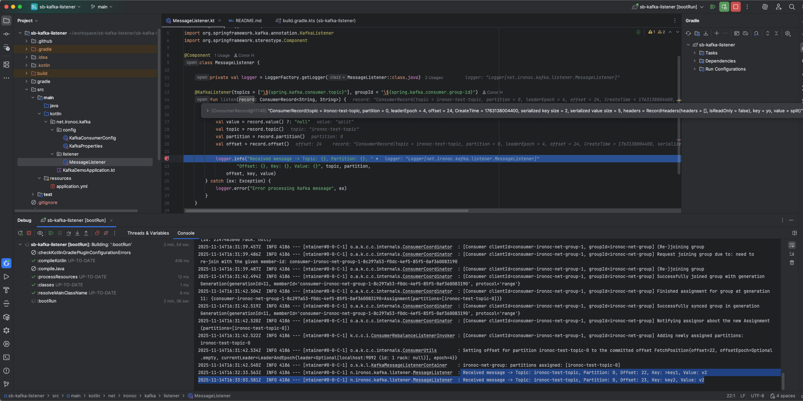

# sb-kafka-listener

[](https://github.com/conorheffron/sb-kafka-listener/actions/workflows/gradle.yml)

## Overview
- Sample Kafka Consumer Service.

## Tech:
- Kotlin, Spring Boot 3, Kafka

## Build Project
```shell
./gradlew clean build
```

## Run Tests
```shell
./gradlew test -i
```

## Run Kafka Listener Service
```shell
./gradlew bootRun
```

## Debug Listener & Catch Incoming Message per Test Topic from Kafka Broker

